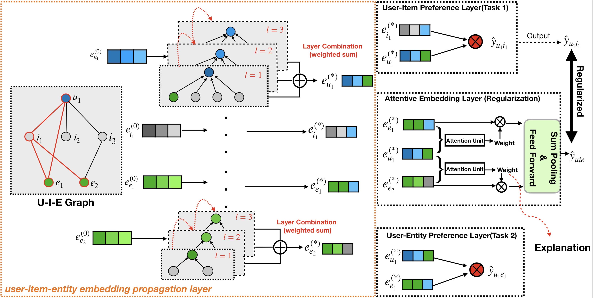
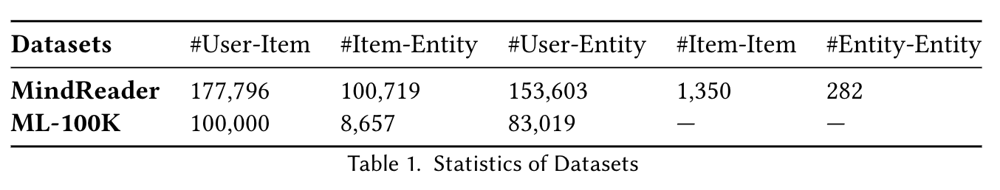
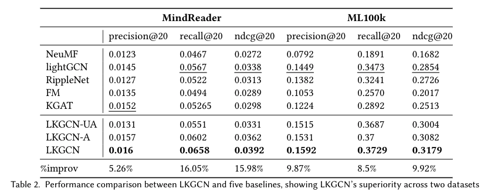

# Entity-Enhanced Graph Convolutional Network for Accurate and Explainable Recommendation

This repository is the official implementation of [Entity-Enhanced Graph Convolutional Network for Accurate and Explainable Recommendation](). 

<p align="center">

</p>
 Light Knowledge Graph Convolutional Network (LKGCN) which explicitly models the high-order connectivities between user items and entities. 
Specifically, we use multi-task learning techniques and attention mechanisms in order to combine user preferences on items and entities.

## Installation

To install requirements, download and install the Python 3.7 version of [Miniconda](https://docs.conda.io/en/latest/miniconda.html) or [Anaconda](https://www.anaconda.com/distribution/#download-section).

Then run the following commands to create a conda environment named `LKGCN` with Python 3.7, and clone this repository into a folder named `LKGCN` your machine.

```bash
git clone https://github.com/anonymous623878848/LKGCN.git
cd LKGCN
conda create -n LKGCN python=3.7
conda env update --name LKGCN --file environment.yml
```

<!-- > 📋Describe how to set up the environment, e.g. pip/conda/docker commands, download datasets, etc... -->

## Training
## Quick start please check 
The instruction of commands has been clearly stated in the [codes](code/parse.py).
To run the code, we need to download the public datasets into the corresponded data folder [Mindread](dataset/mindreader) or [ML-100k](dataset/ml-100k).
```bash
cd code
python main.py --decay=1e-4 --lr=0.0001 --layer=3 --seed=2020 --dataset="mindreaderMulti" --topks="[20]" --recdim=64 --model="lgnMultiAtt" --testbatch=256 --bpr_batch=256 --epochs=100 --lbd=0.5 --beta=0.5 --comment="Att" --tensorboard=0
```
<!-- 
```train
python train.py --input-data <path_to_data> --alpha 10 --beta 20
```

> 📋Describe how to train the models, with example commands on how to train the models in your paper, including the full training procedure and appropriate hyperparameters. -->

## Evaluation
To evaluate the effectiveness of LKGCN, we conduct experiments on the dataset: [Mindreader](https://mindreader.tech/dataset/) and [ML-100K](https://grouplens.org/datasets/movielens/100k/)
The key statistics of the datasets are summarised in Table 1.
<p align="center">

</p>

<!-- To evaluate my model on ImageNet, run:

```eval
python eval.py --model-file mymodel.pth --benchmark imagenet
```
 -->


## Results
Our model achieves the following performance on different datasets comparing with different models:

<p align="center">

</p>

<!-- Our model achieves the following performance on :

### [Image Classification on ImageNet](https://paperswithcode.com/sota/image-classification-on-imagenet)

| Model name         | Top 1 Accuracy  | Top 5 Accuracy |
| ------------------ |---------------- | -------------- |
| My awesome model   |     85%         |      95%       |

> 📋Include a table of results from your paper, and link back to the leaderboard for clarity and context. If your main result is a figure, include that figure and link to the command or notebook to reproduce it. 
 -->

## Contributing

> 📋Pick a licence and describe how to contribute to your code repository. 
